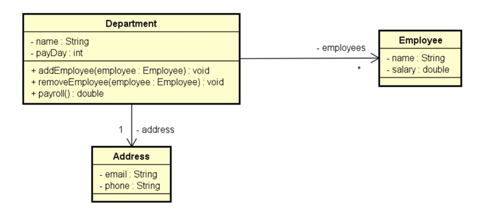

# Desafio: Empregados OO

## 📝 Descrição

O objetivo deste desafio é desenvolver um programa orientado a objetos (OO) em C# para gerenciar um departamento de uma empresa, seus empregados e endereço. 
O sistema deve permitir a criação de um objeto `Department`, associar a ele um endereço (`Address`) e uma lista de empregados (`Employee`). 
Em seguida, o sistema deve gerar um **relatório de folha de pagamento** utilizando um método chamado `ShowReport`.

---



## Estrutura de Classes

### Classe `Department`

| Atributo       | Tipo    | Descrição                           |
|----------------|---------|-------------------------------------|
| name           | string  | Nome do departamento                |
| payDay         | int     | Dia do pagamento                    |
| address        | Address | Endereço do departamento            |
| employees      | List<Employee> | Lista de empregados            |

| Método                 | Retorno  | Descrição                                       |
|------------------------|----------|-------------------------------------------------|
| addEmployee(emp)       | void     | Adiciona um empregado ao departamento           |
| removeEmployee(emp)    | void     | Remove um empregado do departamento             |
| payroll()              | double   | Retorna o valor total da folha de pagamento     |

---

### Classe `Employee`

| Atributo   | Tipo    | Descrição                 |
|------------|---------|---------------------------|
| name       | string  | Nome do empregado         |
| salary     | double  | Salário do empregado      |

---

### Classe `Address`

| Atributo   | Tipo    | Descrição                       |
|------------|---------|---------------------------------|
| email      | string  | E-mail do departamento          |
| phone      | string  | Telefone do departamento        |

---

## Exemplo de Execução

```bash
Nome do departamento: Vendas
Dia do pagamento: 10
Email: vendas@lojatop.com
Telefone: 99883355
Quantos funcionários tem o departamento? 2

Dados do funcionário 1:
Nome: João Silva
Salário: 8000.00

Dados do funcionário 2:
Nome: Maria Torres
Salário: 10000.00

FOLHA DE PAGAMENTO:
Departamento Vendas = R$ 18000.00
Pagamento realizado no dia 10
Funcionários:
João Silva
Maria Torres
Para dúvidas favor entrar em contato: vendas@lojatop.com
